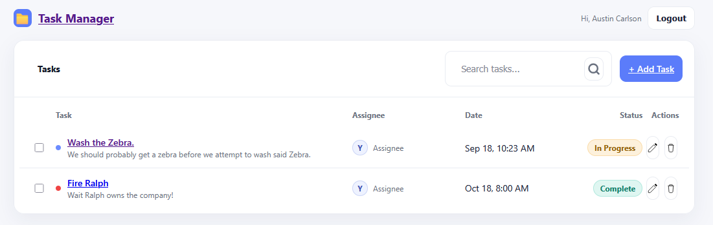
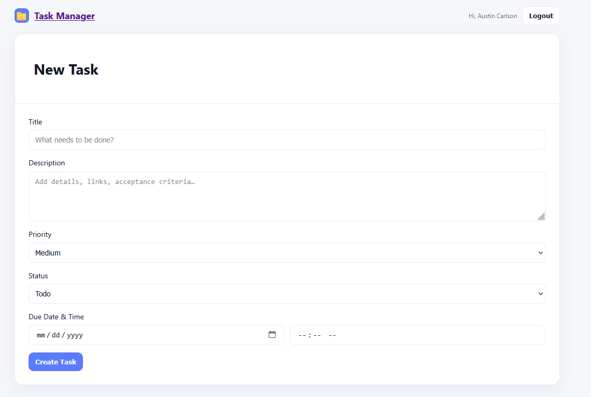
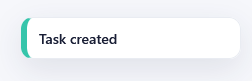

# ✅ Task Manager (React + TypeScript + Auth0)

[](https://github.com/growthwithcoding)


A modern **Task Management Application** built with **React 19 + TypeScript**, using **Vite 7** as the bundler.  
Features include full CRUD (Create, Read, Update, Delete) for tasks, Auth0 authentication, global state with Context API + Reducer, and form validation with Zod.

---

## ✨ Features

### Tasks
- Dashboard with live search filter
- Create, edit, delete tasks with toast notifications
- Status pills that cycle on click/scroll
- Task details page with priority, status, and due date
- LocalStorage persistence (swap for API later)

### Auth & Security
- Auth0 login/logout flow
- Protected routes (only logged-in users see tasks)
- Tasks linked to users via Auth0 `sub` (optional extension)

### Forms & Validation
- Shared `TaskForm` component for Create/Edit
- **React Hook Form** + **Zod** validation
- Custom date+time picker split (date + time inputs)

### UX
- Toast notifications for actions
- Clean Taskia-inspired UI (Poppins font, cards, gradients)
- Responsive layout, accessible inputs/buttons

---

## 🛠️ Tech Stack

- **Framework**: [React 19](https://react.dev/) + [Vite 7](https://vitejs.dev/)
- **Language**: [TypeScript](https://www.typescriptlang.org/)
- **Auth**: [Auth0](https://auth0.com/)
- **Routing**: [React Router 7](https://reactrouter.com/)
- **Forms**: [React Hook Form](https://react-hook-form.com/) + [Zod](https://zod.dev/)
- **State**: Context API + Reducer
- **Storage**: LocalStorage persistence
- **Styling**: Custom CSS (globals.css), Taskia-inspired theme

---

## 🚀 Getting Started

### Prerequisites
- Node.js 18+
- npm or yarn
- An Auth0 account with SPA app setup

### Installation
```bash
git clone https://github.com/growthwithcoding/task-manager-ts.git
cd task-manager-ts
npm install
```

### Development
```bash
npm run dev
```
App will run at [http://localhost:5173](http://localhost:5173).

### Build & Preview
```bash
npm run build
npm run preview
```

---

## 🔑 Environment Variables

Copy `.env.example` → `.env` and fill in your Auth0 values.

```env
VITE_AUTH0_DOMAIN=your-tenant.us.auth0.com
VITE_AUTH0_CLIENT_ID=your-client-id
VITE_AUTH0_CALLBACK=http://localhost:5173
```

---

## 📂 Project Structure

```
task-manager-ts/
├── public/                 # Static assets
├── src/
│   ├── auth/               # Auth0 provider
│   ├── components/         # TaskItem, TaskList, TaskForm
│   ├── data/               # LocalStorage service
│   ├── pages/              # Dashboard, Create, Edit, Details
│   ├── routes/             # Router + ProtectedRoute
│   ├── state/              # Context, reducer, hook
│   ├── styles/             # globals.css
│   ├── types/              # Task types + schema
│   ├── ui/                 # Toast provider
│   ├── App.tsx             # Root layout
│   └── main.tsx            # Entry point
├── package.json
├── vite.config.ts
├── build_file_structure.ps1
└── README.md
```

---

## 📸 Screenshots

### Dashboard
Task list with search, status pills, and CRUD actions.



### Create/Edit Form
Shared form with validation and date+time picker.



### Toasts
Lightweight notifications for actions.



---

## 🤝 Contributing

Pull requests are welcome!  
Feel free to fork this repo and open an issue or PR.

---

© 2025 [growthwithcoding](https://github.com/growthwithcoding). All rights reserved.